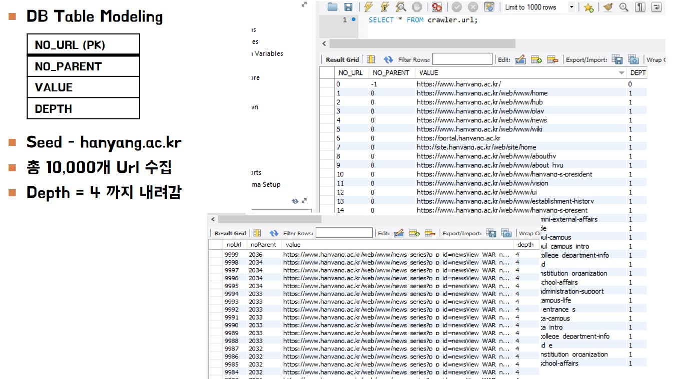
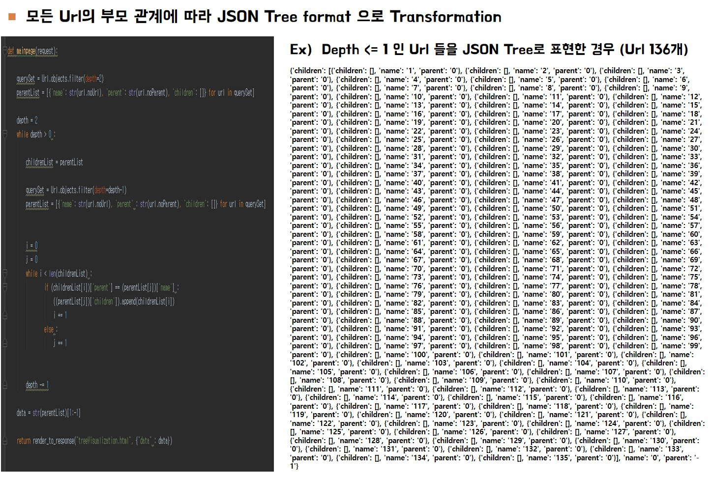
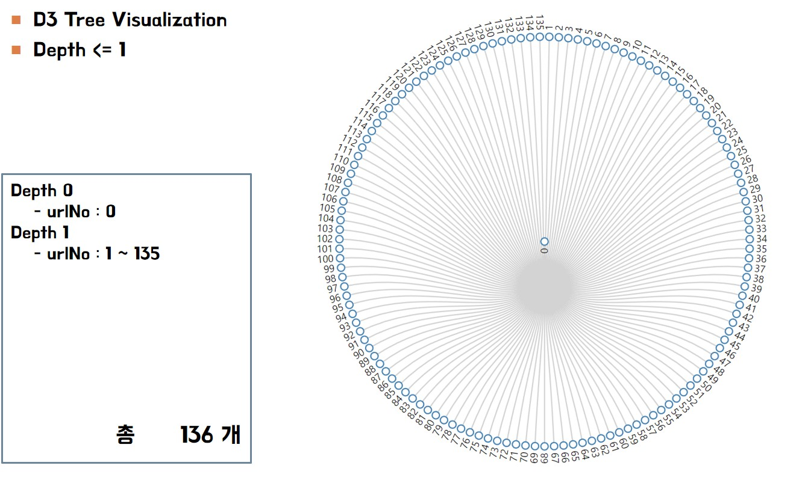
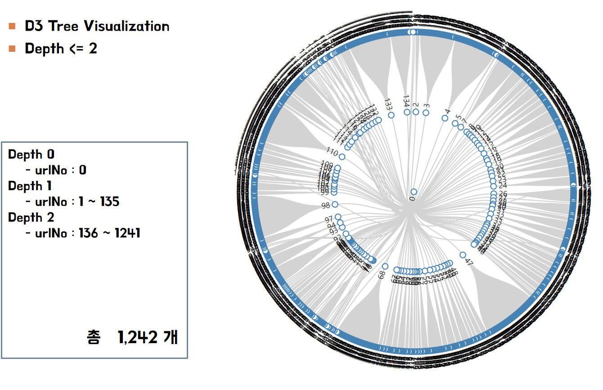
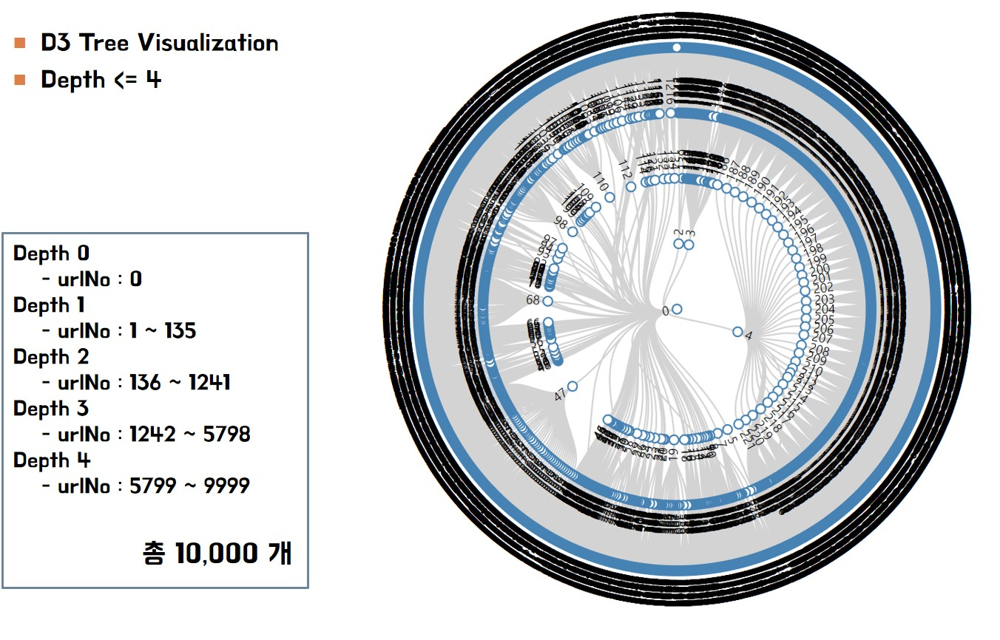

# django-site-tree-visualization
웹 사이트의 링크 구조를 트리 모양으로 시각화 해주는 django 서버

## Data 구성 및 스키마

  

    
  

## Data 구조

  

    
  

## Depth에 따른 Visualization

  

    
    
  

  

    
    
  

